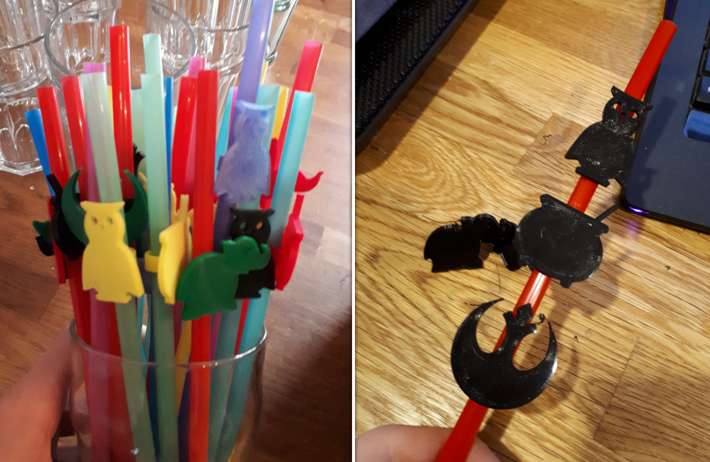

# Straw Marker

In an effort to reduce plastic waste on parties I came up with the idea to give each straw an individual marker. This would make it more easy for the guests to remember which glass belongs to them. I looked through thingiverse for nice 3D models that are suitable for this job and then modified those with a ring so they can be slid on the straws.

_(Straws with unique markers)_

## Remade from these sources

- https://www.thingiverse.com/thing:2912504
- https://www.thingiverse.com/thing:32008
- https://www.thingiverse.com/thing:1238843
- https://www.thingiverse.com/thing:31313
- https://www.thingiverse.com/thing:2238123
